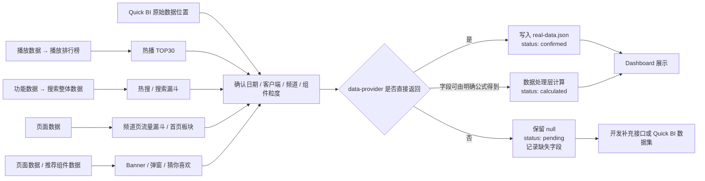
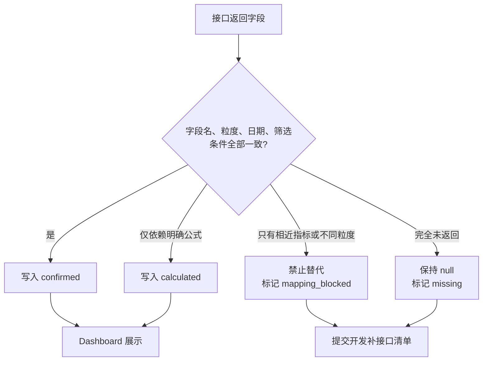

# data-provider 缺失字段与 Quick BI 定位流程图

> 用途：交给开发确认 Quick BI 原始字段、接口补充范围和计算口径。
>
> 结论依据：已对 data-provider 当前接口进行只读测试。`data-provider` 未返回的字段不得用相近指标替代，也不得通过标题或内容猜测关联。

## 一、开发取数流程



## 二、已确认缺失字段及 Quick BI 位置

状态说明：

- `confirmed`：data-provider 已直接返回，可写入看板。
- `calculated`：依赖字段已返回，可按明确公式计算。
- `missing`：本轮 data-provider 测试未返回，不能替代或猜测。
- `mapping_blocked`：接口有相关数据，但当前粒度、筛选条件或字段口径无法安全映射。

本表每个缺失字段的统一元数据：`snapshot_date=2026-08-02`，`source=data-provider`，`status=pending`。其中转化率字段是因为依赖 UV 缺失而保持 `pending`，不是使用替代转化率。

| 模块 | 缺失字段 | Quick BI 对应位置 | data-provider 测试结果 | 开发处理 |
|---|---|---|---|---|
| 热播 TOP30 | `play_uv` 播放人数 | 播放数据 → 播放排行榜 | `season-play-vv`、`play-top10` 均未返回播放人数 | 补充播放人数 UV 字段 |
| 热播 TOP30 | `ranking_type` 榜单类型 | 播放数据 → 播放排行榜 | 仅返回不同榜单数组，没有当前记录对应的直接字段 | 明确榜单类型字段或拆分榜单 |
| 热搜 TOP30 | `search_uv` 搜索人数 | 功能数据 → 搜索整体数据 | `all-hotwords`、`near2hour` 仅返回 `words`、`counts` | 补充搜索 UV |
| 热搜 TOP30 | `content_type` 内容类型 | 功能数据 → 搜索整体数据 | 搜索接口未返回 | 补充内容类型维度 |
| 热搜 TOP30 | `genre` 题材 | 功能数据 → 搜索整体数据 | 搜索接口未返回 | 补充题材维度，不允许猜测关联 |
| 热搜 TOP30 | `user_type` 用户类型 | 功能数据 → 搜索整体数据 | 搜索接口未返回 | 补充新用户 / 老用户筛选维度 |
| 搜索漏斗 | `search_uv` 搜索 UV | 功能数据 → 搜索整体数据 | 未返回分步搜索 UV | 补充漏斗首步 UV |
| 搜索漏斗 | `detail_uv` 详情 UV | 功能数据 → 搜索整体数据 | 未返回 | 补充详情页 UV |
| 搜索漏斗 | `first_play_uv` 首帧播放 UV | 功能数据 → 搜索整体数据 | 未返回 | 补充首帧播放 UV |
| 搜索漏斗 | `5min_play_uv` 5 分钟播放 UV | 功能数据 → 搜索整体数据 | 未返回 | 补充有效播放 UV |
| 搜索漏斗 | `finish_uv` 完成播放 UV | 功能数据 → 搜索整体数据 | 未返回 | 补充完成播放 UV |
| 搜索漏斗 | `search_to_detail` | 功能数据 → 搜索整体数据 | 依赖字段缺失，无法计算 | `detail_uv / search_uv` |
| 搜索漏斗 | `detail_to_first_play` | 功能数据 → 搜索整体数据 | 依赖字段缺失，无法计算 | `first_play_uv / detail_uv` |
| 搜索漏斗 | `effective_play_rate` | 功能数据 → 搜索整体数据 | 依赖字段缺失，无法计算 | `5min_play_uv / first_play_uv` |
| 搜索漏斗 | `finish_rate` | 功能数据 → 搜索整体数据 | 依赖字段缺失，无法计算 | `finish_uv / first_play_uv` |
| 频道页流量漏斗 | `home_uv` 首页 UV | 页面数据 | 未返回当前漏斗所需首页 UV | 补充页面级 UV |
| 频道页流量漏斗 | `channel_uv` 频道页 UV | 页面数据 | 有页面 / 板块曝光，但不是当前频道漏斗粒度 | 补充频道页 UV |
| 频道页流量漏斗 | `detail_uv` 详情 UV | 页面数据 | 未返回当前频道漏斗详情 UV | 补充详情页 UV |
| 频道页流量漏斗 | `play_uv` 播放 UV | 页面数据 | 未返回当前频道漏斗播放 UV | 补充播放 UV |
| 频道页流量漏斗 | `conversion_rate` | 页面数据 | 依赖频道漏斗 UV 缺失 | 明确分母后计算 |
| 频道页流量漏斗 | `day_change` | 页面数据 | 当前频道漏斗指标缺失，无法计算 | 查询前一日同口径数据后计算 |
| 首页板块 | `play_count` 板块播放 | 页面数据 | `section` 返回曝光 / 点击，没有播放字段 | 补充板块播放次数 |
| 首页板块 | `effective_play_count` 有效播放 | 页面数据 | `section` 未返回有效播放字段 | 补充 5 分钟有效播放次数 |
| 首页板块 | `conversion_rate` 点击转化率 | 页面数据 | 现有接口没有明确看板口径 | 明确按点击 / 曝光 PV 或 UV 计算 |
| Banner | `play_count` 跳转播放 | 页面数据 / 推荐组件数据 | `banner-click` 只有曝光 / 点击，没有播放字段 | 补充跳转后的播放归因 |
| Banner | `effective_play_count` 有效播放 | 页面数据 / 推荐组件数据 | 未返回有效播放字段 | 补充有效播放归因 |

## 三、不能作为“缺失字段”直接补写的字段

| 字段 | 当前接口情况 | 原因 |
|---|---|---|
| Banner `position` | `banner-click` 返回 `position_id`、`banner_position` | 同一剧名对应多个位置、频道和客户端，必须先确定筛选键，不能按剧名合并 |
| 平台人均播放时长 | `per-capita-watch` 可返回部分 `clienttype` 原始结果 | 没有直接返回看板 `iOS / Android / M站` 聚合口径，需开发确认客户端编码映射 |
| 搜索转化率 | `search-click-conversion` 返回整体搜索转化率 | 与当前搜索漏斗的分步 UV 不是同一口径，不能替代 `search_to_detail` 等字段 |
| 首页 / 频道曝光点击 | `section`、`custom-navigation` 返回板块或页面曝光点击 | 粒度不等于当前频道漏斗，不能直接把板块 UV 相加为频道 UV |

## 四、给开发的补充接口最小清单

```text
1. 播放排行榜：play_uv、ranking_type
2. 搜索整体数据：search_uv、content_type、genre、user_type
3. 搜索漏斗：search_uv、detail_uv、first_play_uv、5min_play_uv、finish_uv
4. 频道页漏斗：home_uv、channel_uv、detail_uv、play_uv，并支持昨日同口径查询
5. 首页板块：play_count、effective_play_count
6. Banner 归因：play_count、effective_play_count，并保留 position、channel、clienttype、title 组合键
7. 平台映射：明确 clienttype 原始编码到 iOS、Android、M站的映射规则
```

## 五、验收规则



数据来源：`data-provider` 只读测试结果；Quick BI 位置来自《运营数据看板数据字典.md》。
