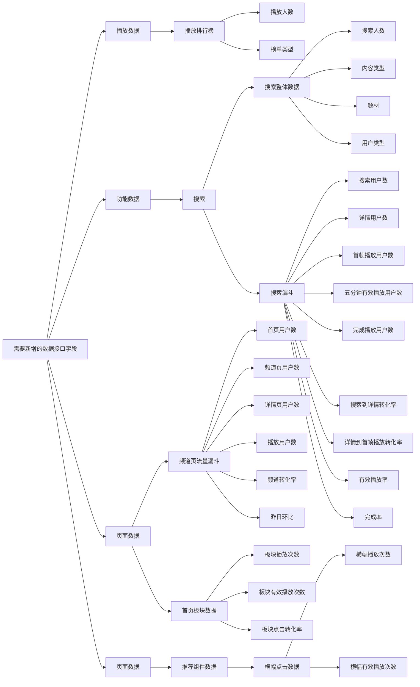

# data-provider缺失字段



## 字段与 Quick BI 位置对应

| 需要新增的接口字段 | Quick BI 位置 |
|---|---|
| 播放人数 | 播放数据 → 播放排行榜 |
| 榜单类型 | 播放数据 → 播放排行榜 |
| 搜索人数 | 功能数据 → 搜索 → 搜索整体数据 |
| 内容类型 | 功能数据 → 搜索 → 搜索整体数据 |
| 题材 | 功能数据 → 搜索 → 搜索整体数据 |
| 用户类型 | 功能数据 → 搜索 → 搜索整体数据 |
| 搜索用户数 | 功能数据 → 搜索 → 搜索漏斗 |
| 详情用户数 | 功能数据 → 搜索 → 搜索漏斗 |
| 首帧播放用户数 | 功能数据 → 搜索 → 搜索漏斗 |
| 五分钟有效播放用户数 | 功能数据 → 搜索 → 搜索漏斗 |
| 完成播放用户数 | 功能数据 → 搜索 → 搜索漏斗 |
| 搜索到详情转化率 | 功能数据 → 搜索 → 搜索漏斗 |
| 详情到首帧播放转化率 | 功能数据 → 搜索 → 搜索漏斗 |
| 有效播放率 | 功能数据 → 搜索 → 搜索漏斗 |
| 完成率 | 功能数据 → 搜索 → 搜索漏斗 |
| 首页用户数 | 页面数据 → 频道页流量漏斗 |
| 频道页用户数 | 页面数据 → 频道页流量漏斗 |
| 详情页用户数 | 页面数据 → 频道页流量漏斗 |
| 播放用户数 | 页面数据 → 频道页流量漏斗 |
| 频道转化率 | 页面数据 → 频道页流量漏斗 |
| 昨日环比 | 页面数据 → 频道页流量漏斗 |
| 板块播放次数 | 页面数据 → 首页板块数据 |
| 板块有效播放次数 | 页面数据 → 首页板块数据 |
| 板块点击转化率 | 页面数据 → 首页板块数据 |
| 横幅播放次数 | 页面数据 → 推荐组件数据 → 横幅点击数据 → 播放明细 |
| 横幅有效播放次数 | 页面数据 → 推荐组件数据 → 横幅点击数据 → 有效播放 |
```
